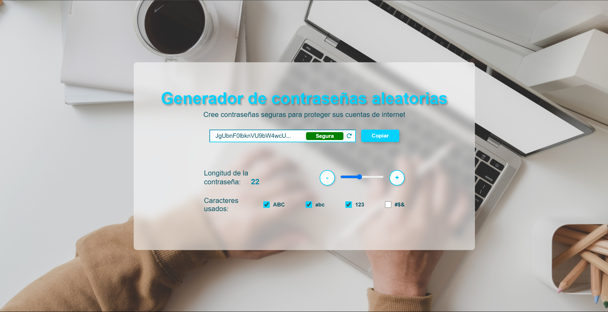

# 🔑 Generador de Contraseñas Aleatorias

## 📌 Descripción

Este proyecto es un **generador de contraseñas aleatorias** que permite crear contraseñas seguras para proteger cuentas de internet. Puedes personalizar la longitud de la contraseña y los tipos de caracteres utilizados, creado por **Maik y Euge**.

## 🌟 Características

- 🔄 Genera contraseñas aleatorias con caracteres personalizados.
- 📏 Permite ajustar la longitud de la contraseña.
- 🛡️ Muestra el nivel de seguridad de la contraseña (**Muy Débil**, **Débil**, **Normal**, **Segura**, **Muy Segura**).
- 📋 Botón para copiar la contraseña generada al portapapeles.
- 🚀 Actualización dinámica de la contraseña al cambiar la longitud o los caracteres.

## 💻 Tecnologías Utilizadas

- HTML
- CSS
- JavaScript

## 🌅 Vista Previa

 

## 🚀 Uso

1. Selecciona los tipos de caracteres que deseas incluir (ABC, abc, 123, #$&).
2. Ajusta la longitud de la contraseña con el control deslizante.
3. Haz clic en el botón de actualizar para generar una nueva contraseña.
4. Haz clic en el botón **"Copiar"** para copiar la contraseña al portapapeles.

## 🛠️ Instalación

Clona el repositorio:

```bash
git clone https://github.com/Chriss-mk/Generadordecontrasenas.git